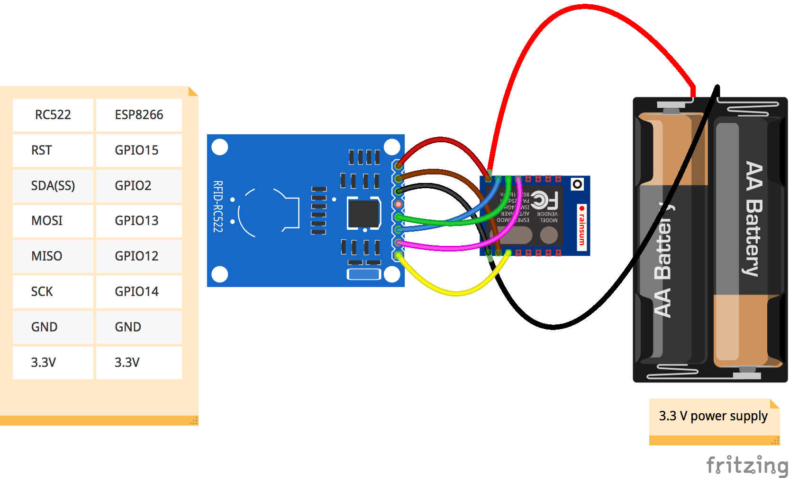

# ESP8266-MFRC522
MFRC522 RFID module connected to ESP8266 (ESP-12) WiFi module

Many thanks to nikxha from the ESP8266 forum

## Requirements
You have to install the Arduino IDE 1.6.4.
* **Arduino** > **Preferences** > "Additional Boards Manager URLs:" and add: **http://arduino.esp8266.com/package_esp8266com_index.json**
* **Arduino** > **Tools** > **Board** > **Boards Manager** > type in **ESP8266** and install the board
* download MFRC522 module (see [Libraries](#libraries)) and copy folder to Arduino library path

## Libraries
* [RFID library by Miguel Balboa](https://github.com/miguelbalboa/rfid)

## Wiring RFID RC522 module


## define RFID module
```c
#include "MFRC522.h"
#define RST_PIN	15 // RST-PIN for RC522 - RFID - SPI - Modul GPIO15 
#define SS_PIN	2  // SDA-PIN for RC522 - RFID - SPI - Modul GPIO2 
MFRC522 mfrc522(SS_PIN, RST_PIN);	// Create MFRC522 instance
```

## Initialize RFID module
```c
void setup() {
  Serial.begin(9600);    // Initialize serial communications
  SPI.begin();	         // Init SPI bus
  mfrc522.PCD_Init();    // Init MFRC522
}
```

## Read RFID tag
```c
void loop() { 
  // Look for new cards
  if ( ! mfrc522.PICC_IsNewCardPresent()) {
    delay(50);
    return;
  }
  // Select one of the cards
  if ( ! mfrc522.PICC_ReadCardSerial()) {
    delay(50);
    return;
  }
  // Show some details of the PICC (that is: the tag/card)
  Serial.print(F("Card UID:"));
  dump_byte_array(mfrc522.uid.uidByte, mfrc522.uid.size);
  Serial.println();
}

// Helper routine to dump a byte array as hex values to Serial
void dump_byte_array(byte *buffer, byte bufferSize) {
  for (byte i = 0; i < bufferSize; i++) {
    Serial.print(buffer[i] < 0x10 ? " 0" : " ");
    Serial.print(buffer[i], HEX);
  }
}
```
